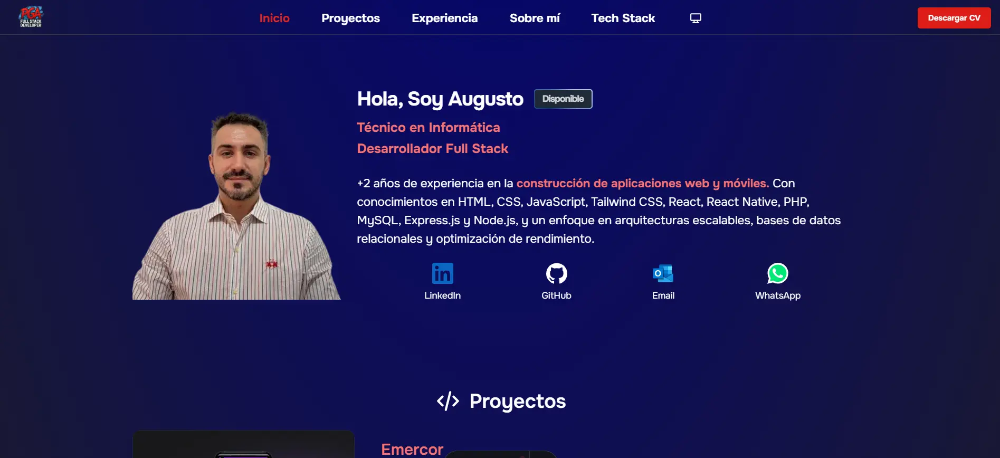

# 

Porfolio personal creado con Astro y Tailwind CSS, que muestra mi experiencia como Desarrollador Full Stack. Incluye secciones destacadas de proyectos, experiencia laboral, tecnologías utilizadas e información de contacto.

### Instalación 
- Clonar repositorio
    - git clone 
- Moverse a la carpeta del proyecto.
    - cd porfolio
- Instalamos las dependencias
    - npm install
- Compilamos
    - npm run dev

### Datos de contacto

- Email: piccoli_44@hotmail.com
- Linkedin: https://www.linkedin.com/in/piccoli-augusto/

